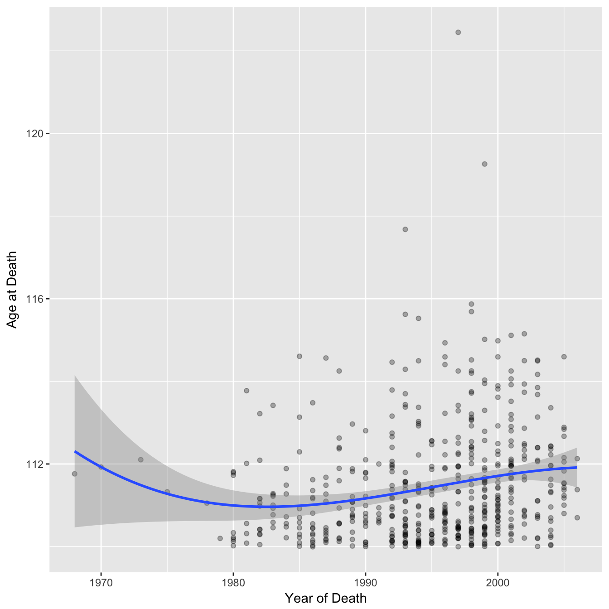
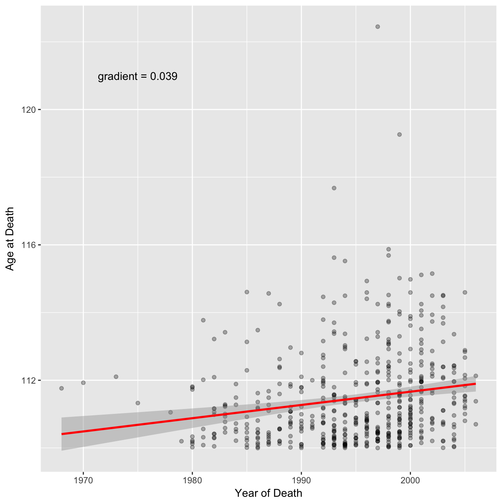
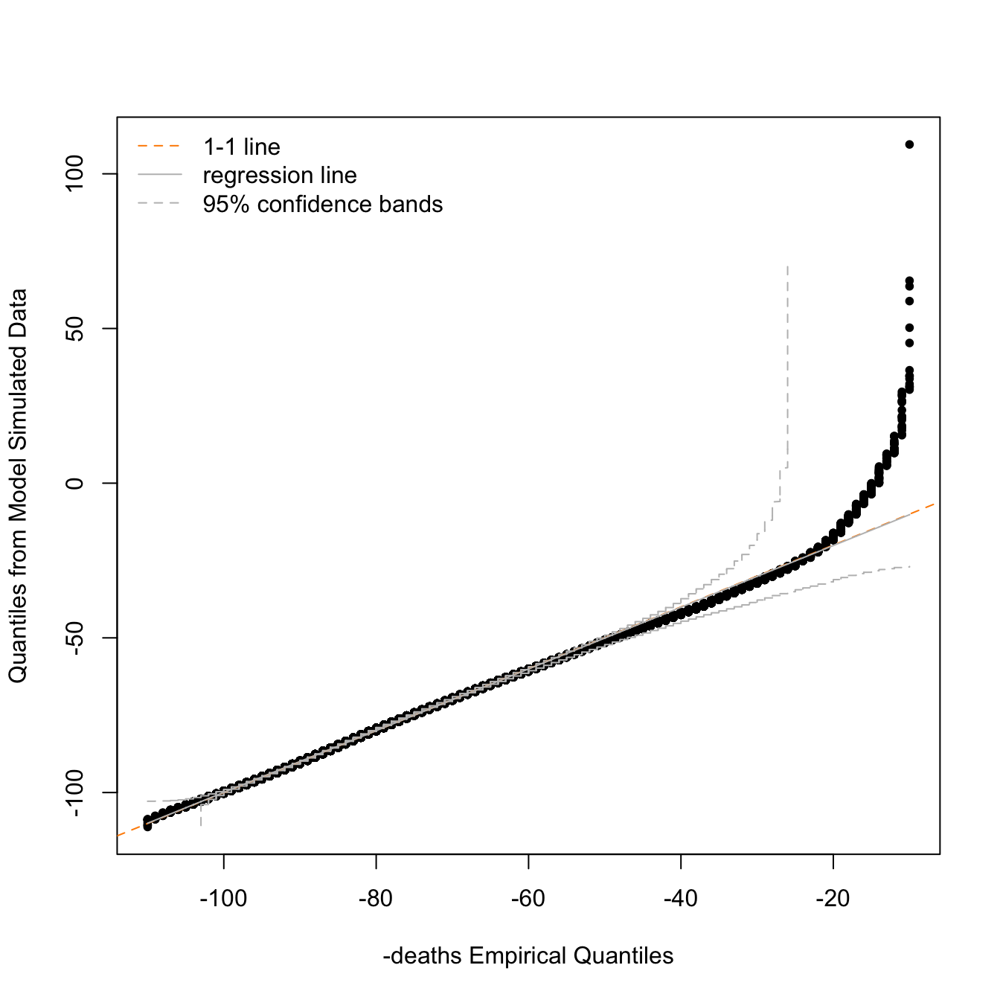
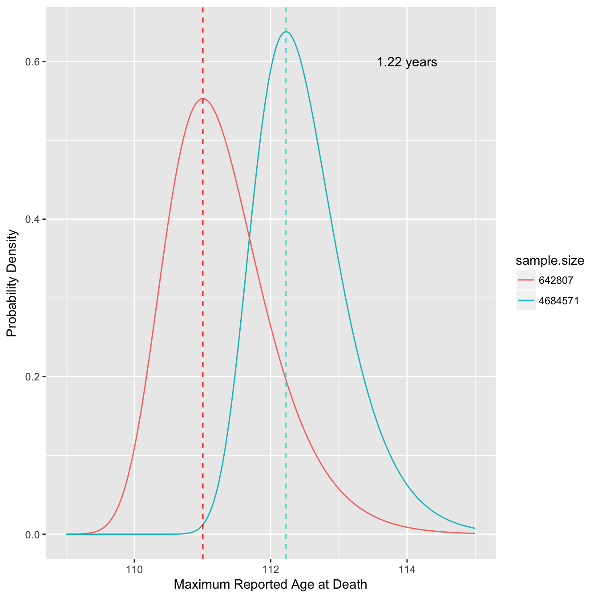
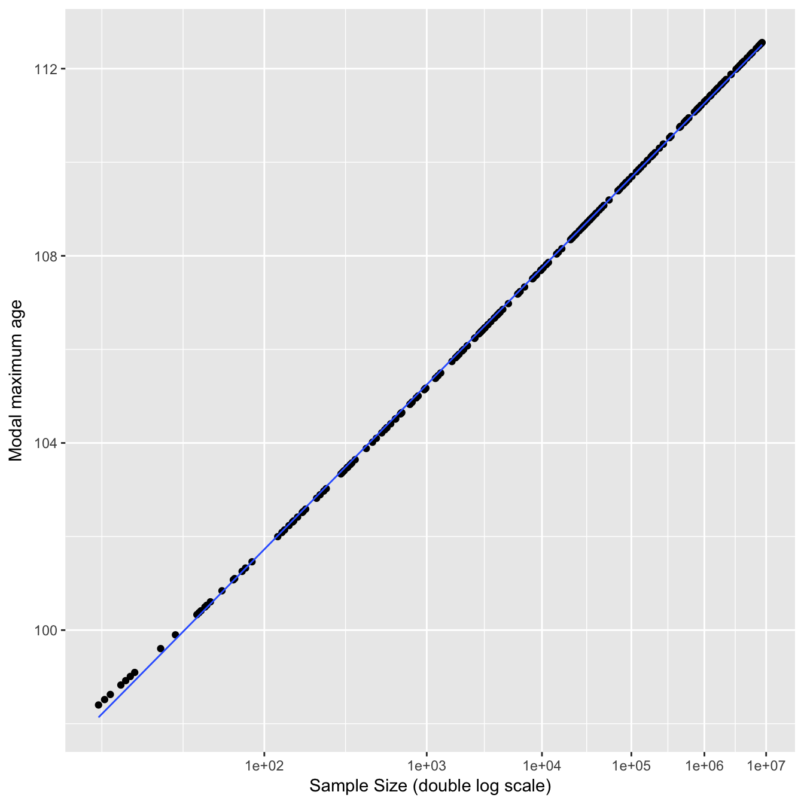
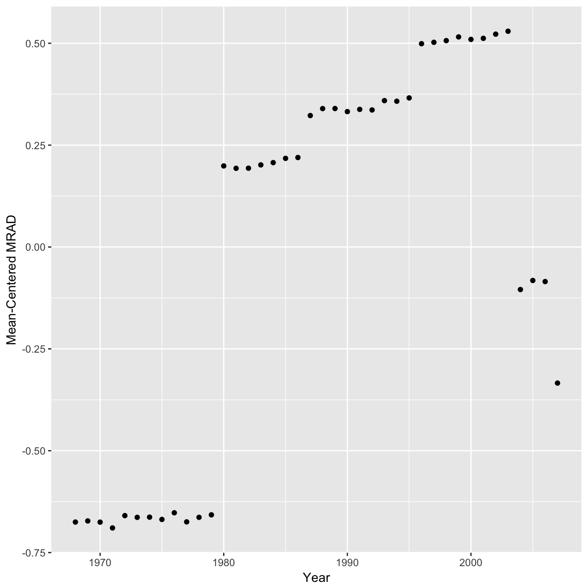

Reanalysis of the evidence for a limit to human lifespan
================
Daniel Wells
2016-11-01

Recently a paper was published in the journal Nature titled "[Evidence for a limit to human lifespan](http://www.nature.com/nature/journal/vaop/ncurrent/full/nature19793.html)" which received wide publicity, by [nature itself](http://www.nature.com/news/human-age-limit-claim-sparks-debate-1.20750), the [New York Times](http://www.nytimes.com/2016/10/06/science/maximum-life-span-study.html), the [Atlantic](http://www.theatlantic.com/science/archive/2016/10/humans-wont-ever-live-far-beyond-115-years/502967/), [the Guardian](https://www.theguardian.com/science/2016/oct/05/human-lifespan-has-hit-its-natural-limit-research-suggests), and [the BBC](http://www.bbc.co.uk/news/health-37552116) to name but a few. However some of the methods in this paper have been criticised:

<blockquote class="twitter-tweet" data-lang="en">

This <a href="https://twitter.com/nature">@nature</a> paper should be renamed ‘Evidence for a limit to Peer-Review’   (ht <a href="https://twitter.com/StuartBuck1">@StuartBuck1</a>)<a href="https://t.co/OsHzPEZScV">https://t.co/OsHzPEZScV</a>

— Amitabh Chandra (@amitabhchandra2) <a href="https://twitter.com/amitabhchandra2/status/784373386826944512">October 7, 2016</a>
</blockquote>
<blockquote class="twitter-tweet" data-cards="hidden" data-lang="en">

So, Nature paper on 'human lifespan limit' makes this inference from those TWO points at the very end!? Total toss. <a href="https://t.co/p1L8FnH9Cw">https://t.co/p1L8FnH9Cw</a> <a href="https://t.co/v7P9YMrJxM">pic.twitter.com/v7P9YMrJxM</a>

— Stuart Ritchie (@StuartJRitchie) <a href="https://twitter.com/StuartJRitchie/status/784319415038844929">October 7, 2016</a>
</blockquote>
In this analysis I look at figure 2 specifically which argues that the maximum age of death has plateaued. You can view the code used in this analysis at [age-limit-analysis.Rmd](age-limit-analysis.Rmd).

I downloaded the data from the [International Database on Longevity at the Max Planck Institute for Demographic Research](http://www.supercentenarians.org). The terms of the data access do not permit third party sharing so the raw data is not uploaded to GitHub but you can download it yourself if you want to rerun the following analyses.

First I load the data into R, tidy up some of the columns, and subset to the same individuals used the in paper. (Not sure why they didn't just use all 668 rather than just 534). Here is the breakdown by country:

    ##    Country.of.death   N
    ## 1:              GBR  66
    ## 2:              JPN  78
    ## 3:              USA 341
    ## 4:              FRA  49

Now let's recreate figure 2A.

### Raw Data

### With regression lines

The authors of the paper fitted two separate regression lines to this data arguing that after 1995 there was a change in the trend (a seemingly arbitrary choice of breakpoint - the choice of a broken vs linear trend has been analysed [elsewhere](https://github.com/philippberens/lifespan)).

You can see from the confidence intervals on the regression lines that the gradient for the second segment is actually consistent with being the same as the first segment. In the paper the authors calculate a p-value of 0.27 for the gradient of the second segment (null hypothesis = 0) and conclude "no further increases were observed". They apply the same reasoning in a reply to a [post-publication review on publons](https://publons.com/review/480517/#c196) "The latter is not significant, so we conclude that the MRAD is essentially flat". However, you can not accept the null hypothesis based on p &gt; 0.05, you can only reject a null hypothesis. In this case a p-value of greater than 0.05 suggests that there is not enough data to conclude that the gradient is different from 0 (perhaps the null hypothesis should really by that the gradient is the same as the first segment, although the p-value is still non significant). The 95% confidence interval for the second segment gradient is −0.83 to +0.20 which includes the point estimate of the first segment gradient of 0.15 (using non rounded age values here).

    ##                 2.5 %    97.5 %
    ## death_year -0.8276784 0.1956178

    ## First segment point estimate:

    ## death_year 
    ##  0.1533292

    ## P-value when H0 = 0.1533:

    ##              Pr(>|t|)
    ## death_year 0.06819191

However this analysis is quite sensitive to the choice of breakpoint. In the above mentioned review response the authors re-analysed the data and found that a breakpoint of 1999 was a better fit. Although the package used ("segmented") fits a continuous piecewise regression, I will continue using the method above to illustrate a different choice of date anyway. Replotting the regression lines using this breakpoint shows the confidence intervals more clearly supporting the downward trend and the p-value (with H0 = 1st segment gradient) is now significant at the 0.05 threshold. The upper 95% confidence interval is now −0.2 suggesting a downward trend (rather than a plateau).

    ## First segment gradient point estimate & confidence intervals:

    ## death_year 
    ##  0.1926284

    ##                 2.5 %   97.5 %
    ## death_year 0.09503971 0.290217

    ## Second segment gradient point estimate & confidence intervals:

    ## death_year 
    ## -0.6874939

    ##                2.5 %     97.5 %
    ## death_year -1.164361 -0.2106265

    ## P-value for second segment when H0 = 0.193:

    ##               Pr(>|t|)
    ## death_year 0.004034243

Higher order maximums (2nd, 3rd etc)
====================================

The authors note that due to the fact that each of these data points is just a single individual the apparent plateau they observe could be due to random fluctuation. To strengthen their argument they looked at the 2nd highest reported age at death, 3rd highest etc and claimed that these series showed the same pattern. However the data points were only plotted for the 1st MRAD and only cubic smoothing splines for the remaining. Fitting a cubic spline could be misleading / overfitting and each series should probably be processed in the same manner as figure 2A if one is to conclude that they show the same pattern. Below I plot each series individually so the actual data is visible. The cubic splines show downward trends towards the end although with increasing uncertainty and linearity. Similarly with the linear regressions the gradient of the second segments are lower than the first segments although with increasing consistency between the two (note variable y-axis).

### Raw Data

### With Cubic Spline

### With Regression Lines

Mean age of death
=================

In another alternate approach the authors looked at all individuals in the dataset to calculate mean age of death and concluded that the annual average age of supercentenarians had not increased since 1968 (the start of the dataset). I recreate their plot below but with the addition of error bars representing the standard error of the mean for each point in order to visualise the uncertainty in the values.

You can see that for the earlier points there are no error bars, this is because there is only a single data point for those years. It is therefore quite misleading to give each mean equal weighting by fitting a cubic spline to point estimates of the means alone.

A perhaps fairer approach is to recreate the graphs but using the whole dataset (note the dataset does not include anyone who died younger than 110). In this form the uncertainty in the first and last few years is much clearer, and the dip pattern fitted above is much less convincing. I would argue that a linear regression fits the data just as well and this gives an increase of ~ 0.04 years per year.

### Cubic Spline

### Linear Regression

Sample Sizes
============

In the study the authors analysed maximum reported age of death (MRAD) over different years but the data for each year was from a different combination of countries and hence the sample size varies. One therefore might expect that the MRAD could change solely due to variation in the sample size (we are more likely to see high maximums when there is more data). Here I investigate the effect of using different sample sizes on the MRAD.

To get an equation for the distribution of age at death we can fit a [generalised extreme value distribution](https://en.wikipedia.org/wiki/Generalized_extreme_value_distribution) to data from the UK [Office of National Statistics](http://www.ons.gov.uk/peoplepopulationandcommunity/birthsdeathsandmarriages/deaths/articles/mortalityinenglandandwales/2012-12-17) (which fits much better than a normal distribution). 

    ##    location       scale       shape 
    ## -86.6589101   9.8271019   0.0372343

We will also need to estimate the sample size (number of deaths) for each year in each country. For this I multiplied the world bank crude death rate by population size. We can then see how the total sample size varies over time in the original papers analysis.

The trend is similar to the regression lines they fit and so any bias from sample size would result in an overestimate in their favour for the gradient of both of the regression lines. However the effect of sample size on MRAD is probably not linear - maybe the population sizes used are large enough that the MRAD is effectively independent. With the sample size and an equation for the distribution of age at death we can now calculate the probability distribution of MRAD (more formally the nth [order statistic](https://en.wikipedia.org/wiki/Order_statistic)) for different sample sizes. First let us look at the distributions of MRAD for the estimated minimum and maximum sample size used in the study.

This shows we might expect a difference of over a year in the MRAD due to the change in sample size alone (dashed lines indicate mode). We can also look at how the modal MRAD changes over many different sample sizes.

The modal MRAD increases sharply at first and then starts to plateau once the sample size increases to millions of deaths. The dashed lines indicate the estimated minimum and maximum sample sizes used in the study. A double log distribution fits this curve well for reasonable sample sizes (&gt;20).

We can also plot the difference from the mean MRAD for each year in the study based on changing sample size alone.

Hence the sample sizes used would probably have a noticeable although small effect on the MRAD and a correction would slightly weaken the authors conclusions by reducing the gradient of both regression lines. Even though the effect is moderate it would have been nice to see an analysis of this type reported in the study.

Whether or not there is a genuine plateau rather than a temporary fluctuation would be clearer if there was more than 7-10 years of data beyond the breakpoint, given it is now a decade on perhaps there is new data available, for example from the [USA Death Master File](https://classic.ntis.gov/products/ssa-dmf/).
